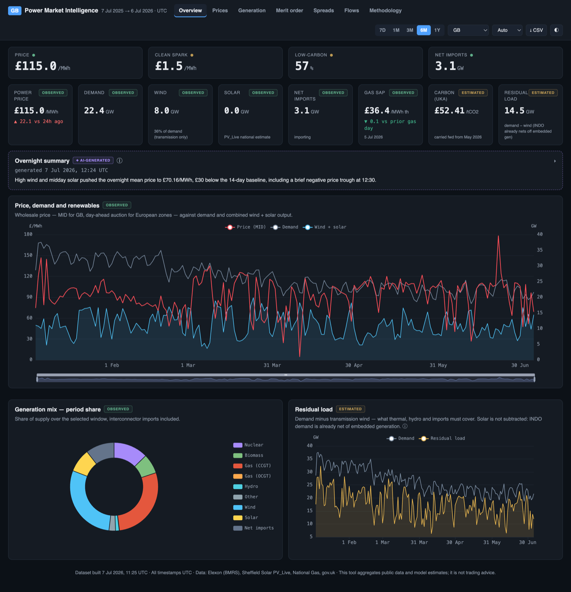
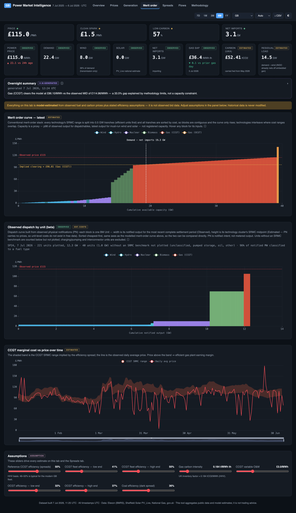
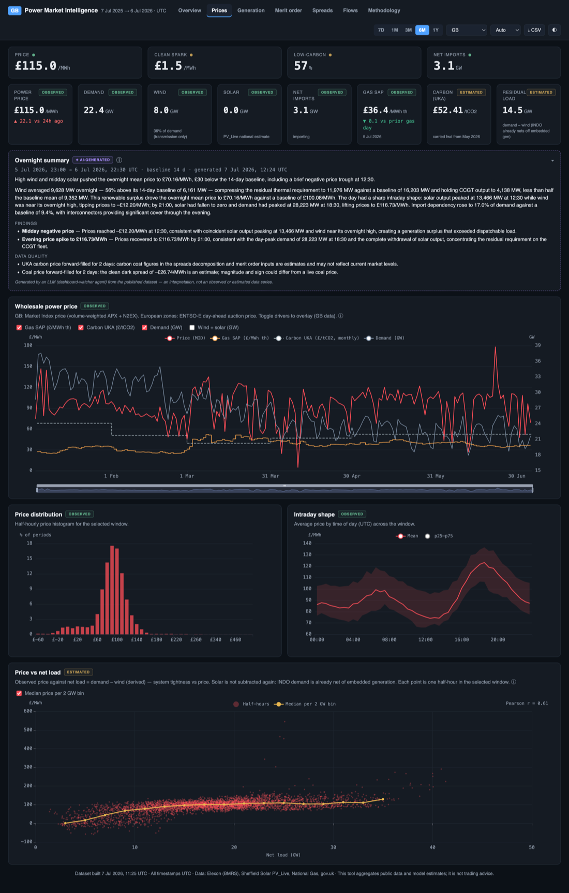
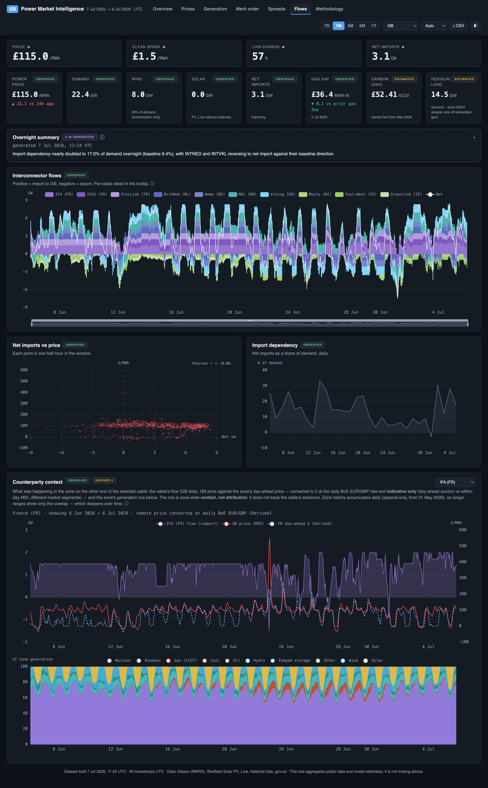

# GB Power Market Intelligence Dashboard

[](https://github.com/lptva/gb-power-dashboard/actions/workflows/tests.yml)

A real-data market intelligence web app for the Great Britain power market, in the style of a commodity-analytics terminal. Single-page, static, no build step, driven entirely by public data fetched through a re-runnable ETL.

**This is not a stylised model.** Every observed series comes from a public market data source; every estimated or assumption-based metric is labelled as such in the UI, panel by panel.



*The Overview tab on real data (July 2026). More screenshots [below](#screenshots).*

## Quick start

**Never used a terminal or installed Python?** Follow [docs/SETUP.md](docs/SETUP.md) instead – a step-by-step guide for Mac and Windows that assumes no experience at all. Or, with Python already installed, `python3 install.py` (Mac) / double-clicking `install.bat` (Windows) does everything below with prompts. The three commands that follow are the short version for people comfortable with a terminal.

```bash
# 0. From wherever you cloned this repository
cd gb-power-dashboard

# 1. Build the dataset and every other pipeline output in one command
#    (BMU dispatch snapshot, stress metrics, zone data, AI summary). On
#    a fresh clone the incremental step falls back to a full rebuild
#    automatically, so this behaves like a full build (≈ 160 chunked
#    API calls, ~3–5 min first run).
python3 ops/refresh.py

# 2. Serve the app (any static server; file:// will not work)
python3 -m http.server 8872 --directory app

# 3. Open http://localhost:8872
```

Every command in this README is written to be run from the repository root, whatever you named it and wherever you cloned it – nothing assumes a particular folder layout or username.

Prefer a one-off full rebuild instead of relying on the automatic fallback (for example, to re-fetch every chunk after clearing `data_raw/cache/`)? Run `python3 etl/build_dataset.py --days 365` directly, then `python3 ops/refresh.py` again afterwards to bring the other four surfaces back in sync, as described in "Refresh process" below.

## The AI summary – optional, and the only thing that isn't free

**The core dashboard needs no subscription of any kind.** Every data source is free (see the table below; everything the GB view uses is keyless, and the token that refreshes the European zones is free too), and every panel – the year of half-hourly data, the merit-order model, spreads, flows, the seven European zones, the scheduled daily refresh works without any
account.

Exactly one feature is different. The collapsed **"Overnight summary"** panel is written by a Claude agent (Anthropic's `claude` CLI) reading the locally published dataset during the daily refresh. It is **off by default and strictly opt-in**: the refresh only attempts it when
`ENABLE_AI_SUMMARY=true` is set in the project-root `.env` (or the environment). Having the claude CLI installed and signed in — perhaps for entirely unrelated work — does **not** enable it; without the flag the step is skipped before the CLI is even looked for, so nobody's
subscription is spent without an explicit decision. If you enable it:

- it requires the [claude CLI](https://claude.com/claude-code) signed in to a **Claude subscription**, and **consumes your own usage allowance**;
- running it daily costs roughly **£8–9 a month** in usage, occasionally a little more on the ~1-in-5 days a structurally invalid reply forces a retry. That figure is measured, not estimated: every run's tokens and API-equivalent cost are logged to `ops/logs/overnight.metrics.log` (source of truth: **$0.36 API-equivalent per run**, ~$11-equivalent per month at current API pricing);
- one run is a single ~5-6-minute model call inside the scheduled refresh – all statistics are precomputed deterministically (`ops/panel_facts.py`), and the model only writes the narrative; a publish gate rejects any output whose figures deviate from the panels' own numbers.

If you do nothing, nothing happens – whether or not the CLI is present: without the opt-in flag the refresh skips the step with a log line, the panel shows a one-line "not enabled" note, and everything else is unaffected. To turn it off again, set `ENABLE_AI_SUMMARY=false` (or delete the line) – absent means off. A summary that stops being regenerated is flagged **⚠ stale** in the panel rather than silently shown as current. The panel's output is always badged *AI-generated* – it is model interpretation of the published data, never a data series.

Requires Python 3.10+ and `certifi` (`pip install certifi`). No other dependencies: the ETL uses only the standard library, and the app is plain HTML/CSS/JS with a vendored copy of ECharts.

## Data sources

| Source | Data | Resolution | Auth | Licence/terms |
|---|---|---|---|---|
| [Elexon Insights API](https://bmrs.elexon.co.uk) | Generation by fuel incl. interconnectors (FUELHH), national demand (INDO), Market Index price (MID) | 30 min | none | free, open |
| [Elexon Insights API](https://bmrs.elexon.co.uk) | Per-unit physical notifications (PN), balancing acceptances (BOALF) and the BM Unit registry — the observed-dispatch panel | per settlement period | none | free, open |
| [ENTSO-E Transparency Platform](https://transparency.entsoe.eu) | Day-ahead prices (A44), generation by type (A75) and load (A65) for the seven European zones | 15–60 min, normalised to 30 min | free token (registration) | free, attribution |
| [Sheffield Solar PV_Live](https://www.solar.sheffield.ac.uk/pvlive/) | GB solar outturn (embedded; invisible to Elexon) | 30 min | none | free, attribution |
| [National Gas data portal](https://data.nationalgas.com) | Gas System Average Price (SAP), item PUBOB603 | daily | none | free |
| [gov.uk UK ETS CCM table](https://www.gov.uk/government/publications/taking-part-in-the-uk-emissions-trading-scheme-markets) | Official average monthly UKA price | monthly | none | OGL |
| [World Bank Pink Sheet](https://www.worldbank.org/en/research/commodity-markets) | Australian thermal coal, 6,000 kcal/kg FOB Newcastle futures, monthly avg (USD/t) — **proxy** for the commercial API2 benchmark | monthly | none | CC BY 4.0 |
| [Bank of England IADB](https://www.bankofengland.co.uk/boeapps/iadb/) | USD/GBP daily spot (XUDLUSS, monthly-averaged for the coal conversion) and EUR/GBP daily spot (XUDLERS, converting counterparty day-ahead prices) | daily | none | free |

Coal conversion: `£/MWh th = USD/t ÷ FX(USD per GBP) ÷ 6.978 MWh th/t`(6,000 kcal/kg = 25.12 GJ/t). The result is badged **Proxy / Derived** in the app; a manually entered coal price overrides it (relabelled Assumption).

Full field mapping, units, timestamp handling and transformations are in [methodology.md](methodology.md) and in the app's Methodology tab (which is generated from the ETL's own metadata, so it cannot drift from the data).

## European zones (ENTSO-E)

The dashboard ships with seven European markets behind the header zone switcher, **viewing them needs nothing**; the zone data is part of the published dataset. *Refreshing* them needs a free ENTSO-E Transparency Platform token:

1. Register at <https://transparency.entsoe.eu>, then email `transparency@entsoe.eu` with the subject "RESTful API access" (they reply in a few working days).
2. `cp .env.example .env` and put the token in it. The `.env` lives at the **project root — never under `app/`**, which is web-served: a token placed there would be downloadable by anyone who can reach the dashboard.
3. Refresh a zone by hand with `python3 etl/fetch_entsoe.py --zone FR --days 30`, or let the daily scheduled refresh keep all seven topped up automatically (zone history accumulates append-only from 31 May 2026).

Zone-set rationale (which markets are included and why, DE_LU's reference-market status, the Irish EIC quirk) is in [methodology.md](methodology.md) under "Zone set (Europe extension)".

## Architecture

```
etl/build_dataset.py     fetch (cached, chunked, retried) → normalise → write
data_raw/cache/          raw API responses keyed by URL hash (resume support)
app/
  data/series_hh.json    columnar half-hourly: epoch s + ~24 series (~2.4 MB/yr)
  data/series_daily.json daily aggregates + gas SAP + monthly UKA (+ ffill flags)
  data/meta.json         provenance registry: source, unit, quality, coverage
  data/manifest.json     publication version + per-file hashes (cache busting)
  data/bmu_snapshot.json per-unit dispatch, latest complete settlement period
  data/zones/<ZONE>/     the seven European markets, same columnar schema
  js/data.js             load, slice, bucket-aggregate (no mutation)
  js/metrics.js          pure formulas: spreads, SRMC, merit ladder, histograms
  js/state.js            in-memory store + pub/sub (no browser storage APIs)
  js/charts.js           17 ECharts panels, per-panel error isolation
  js/ui.js               KPIs, assumption sliders, methodology, CSV export
  js/app.js              bootstrap + event wiring
  vendor/echarts.min.js  vendored — works offline once data is built
```

Design rules enforced throughout:

- **Observed vs estimated vs proxy vs assumption** – every panel and KPI carries a badge; assumption sliders (efficiencies, carbon intensity, VOM, coal override) re-derive estimates on the fly but never touch the stored historical layer.
- **No fabricated data** – the clean dark spread uses a clearly labelled futures-derived coal proxy (or your manual override); UKA and coal values beyond the last published month are forward-filled and explicitly flagged.
- **No browser storage** – state is in-memory only; reload restores defaults.

## Refresh process

Day to day, run the whole pipeline with `python3 ops/refresh.py` – it updates the core dataset (incremental mode: ~10 HTTP calls, seconds instead of minutes, merged onto the published dataset atomically behind a validation guard, window rolling at 365 days), the observed-dispatch
snapshot, system-stress metrics, the seven European zone appends, and the optional AI summary, all in one command:

```bash
python3 ops/refresh.py
```

Running `python3 etl/build_dataset.py --incremental` on its own only updates the core dataset and leaves the other four outputs (BMU snapshot, stress metrics, zone data, overnight summary) stale. It is still the right command for a one-off full rebuild:

```bash
python3 etl/build_dataset.py --days 365
```

`--days 365` forces a full rebuild (raw responses are cached in `data_raw/cache/`, so even that only fetches missing chunks; delete the cache or pass `--no-cache` to re-fetch everything). Follow a full rebuild with `python3 ops/refresh.py` to bring the other four surfaces back in
sync. The app reads whatever is in `app/data/` at page load — no server restart needed beyond a browser refresh.

To run the whole pipeline daily without thinking about it, install the scheduled job (opt-in, one command; details and uninstall in [ops/README.md](ops/README.md)):

```bash
bash ops/install_schedule.sh          # Mac (launchd, daily 07:00)
powershell -ExecutionPolicy Bypass -File ops\install_schedule.ps1   # Windows
```

## Tests

```
python3 -m unittest discover -s tests -v
```

Stdlib `unittest`, no dependencies – consistent with the rest of the project; the same suite runs on every push via GitHub Actions (the badge at the top of this page). Four suites, anchored on the places that have already caught real bugs: `tests/test_merit_panel_figures.py` checks `ops/merit_panel_figures.py` against the app's own `metrics.js` outputs (captured in a real browser) on three real-data fixtures — this is the guard that stops the overnight LLM inventing SRMC figures, so it gets its own safety net; `tests/test_overnight_validator.py` pins the publish gate, including the assumption-vocabulary regex against the verbatim sentence from the run that motivated it; `tests/test_panel_facts.py` verifies the precomputed summary statistics against a hand-calculated synthetic dataset; `tests/test_env_flags.py` pins the AI summary's opt-in default (absent means off) and its environment-over-`.env` precedence.

## Screenshots

The Merit order tab – the modelled SRMC merit-order curve with its implied clearing price, the observed per-unit dispatch curve beside it for direct comparison, and the assumption sliders that drive every estimate on the tab:



| Prices | Flows |
|---|---|
|  |  |

Every value in these captures is what the app computes from the public sources – nothing is mocked up for the screenshots, which is also why the timestamps in them will lag the repository's live data.

## Known limitations

- **MID is a proxy** for the GB spot price (volume-weighted short-term trades), not the day-ahead auction; auction prices are commercial data.
- **Gas SAP is a within-day average**, which lags the forward curve in fast markets; spreads computed from it are indicators, not tradable margins.
- **UKA is a monthly average** published with a lag; daily carbon settlement prices are ICE commercial data.
- **The coal proxy is FOB Newcastle, not API2 CIF ARA** – levels track the European benchmark but do not equal it (freight and quality basis differ).
- **Embedded wind (~6 GW)** is invisible to every free source used; "wind" here means transmission-metered wind. Residual/net load (INDO − wind) absorb it silently on the demand side; gross wind output and share metrics understate it.
- **Merit-curve capacity is a proxy** (p98 of observed output for dispatchables, latest output for wind/solar), not registered capacity.
- **Merit-order costs are technology-cluster level.** The "Observed dispatch by unit" panel shows per-unit notified volumes, but unit-level costs do not exist in free data (physical notifications carry no prices) – see `plan/05-plant-level-merit-order.md` for the scoping.